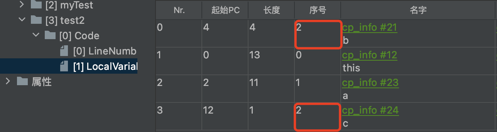
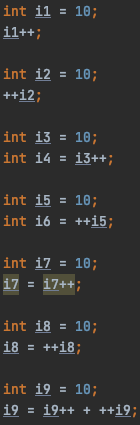

# Java虚拟机（Java Virtual Machine）

[TOC]

## JVM整体架构

### 指令集架构


> **Java是基于栈的指令集架构**

1. 基于栈式架构
   - 设计和实现简单，适用于资源受限的系统
   - 避开寄存器分配难题，使用零地址指令方式分配
   - 指令集更小，编译器容易实现
   - 不需要硬件支持，可移植性好  

2. 基于寄存器架构
   - 典型应用是x86的二进制指令集：如PC以及Android的Davlik虚拟机
   - 指令级架构完全依赖硬件，可移植性差
   - 性能优秀、执行更高效
   - 一般一地址、二地址、三地址指令为主。

### Java反编译

```java
public class Main {
    public static void main(String[] args) {
        int i = 2, j = 3;
        int k = i + j;
    }
}
```

```bash
# 执行反编译
javap -v Main.class
```

```bash
# 其中的部分代码
public static void main(java.lang.String[]);
    descriptor: ([Ljava/lang/String;)V
    flags: ACC_PUBLIC, ACC_STATIC
    Code:
      stack=2, locals=4, args_size=1
         0: iconst_2
         1: istore_1
         2: iconst_3
         3: istore_2
         4: iload_1
         5: iload_2
         6: iadd
         7: istore_3
         8: return
```

### JVM的生命周期

#### 启动

通过引导类加载器（bootstrap class loader）创建一个初始类（initial class）来完成。

#### 执行

java虚拟机进程来执行java程序

#### 结束

正常结束、异常错误中指，线程Runtime的exit、halt方法或System类的exit方法。

### JVM虚拟机

- #### Sun Classic VM


1996年发布，JDK1.4被淘汰，只提供解释器。如果使用JIT编译器，就需要外挂。hotspot内置了此虚拟机。

- #### Exact VM


JDK1.2时提供。Exact Memory Management：准确式内存管理。

可以知道内存中某个位置的数据具体是什么类型。

具备现代高性能虚拟机的雏形：热点探测、编译器与解释器混合工作模式。

只在Solaris平台短暂使用，其他平台还是Classic VM

- #### HotSpot VM


JDK1.3时成为默认虚拟机。方法区概念只在HotSpot中有。

**热点代码探测技术**：

​	通过计数器找到最具编译价值的代码，触发即时编译或栈上替换。

​	通过编译器和解释器协同工作，在最优化的程序响应时间和最佳执行性能中取得平衡。

- #### JRockit


专注于服务器端应用，不包含解析器实现，全部代码都考即时编译器编译后执行。

JRockit JVM是最快的JVM。

**Mission Control**：监控、管理和分析工具。

- #### IBM J9


市场定位和HotSpot接近，2017年开源J9：Eclipse OpenJ9

> **上述三款为主流三大虚拟机**

- #### KVM和CDC/CLDC Hotspot


 针对JavaME产品线。KVM(Kilobyte)是CLDC-HI早期产品。

- #### Azul VM


与特定硬件平台绑定、软硬件配合的专有虚拟机

2021年推出软件平台的Zing JVM

- #### Liquid VM


BEA公司开发，直接运行在自家Hypervisor系统。不需要操作系统支持，本身实现专用操作系统的必要功能，如线程调度、文件系统、网络支持等。

- #### Apache Harmony


JDK1.5、1.6兼容的Java运行平台。IBM和Intel联合开发的开源JVM。其Java类库代码吸纳进了Android SDK。

- #### Microsoft JVM


为了在IE3浏览器中支持Java Applets开发的。

- #### Taobao JVM


基于OpenJDK开发的定制版本。

​	创新的GCIH（GC invisible heap）实现了off-heap，即将生命周期较长的Java对象从heap移动到heap之外，并且GC不能管理GCIH内部的Java对象，以此达到降低GC回收频率和提升GC回收效率的目的。

​	GCIH对象能够在多个Java虚拟机进程中实现共享
​	使用crc32指令实现JVM指令的JVM intrinsic 降低JNI的调用开销。
​	PMU hardware的Java profiling tool和诊断协助功能
​	针对大数据场景的ZenGC

**严重依赖intel的cpu**,丧失兼容性，提高性能。

- #### Dalvik VM


谷歌开发，在Android2.2提供了JIT。在5.0版本后替换为支持提前编译的ART VM。没有遵循Java虚拟机规范。

- #### 其他JVM


Java Card VM、Squawk VM、Maxine VM、Sable VM、Kaffe、MRP……

- #### Graal VM


2018年Oracle公开。在HotSpot VM基础上增强而成的跨语言全栈虚拟机。

## 类加载子系统


> 类加载器负责将class文件加载。加载的类信息存放于方法去中。除了类的信息外，方法区还存放运行时常量池信息。

```bash
Constant pool:
   #1 = Methodref          #3.#21         // java/lang/Object."<init>":()V
   #2 = Class              #22            // Main
   #3 = Class              #23            // java/lang/Object
   #4 = Utf8               <init>
   #5 = Utf8               ()V
   #6 = Utf8               Code
   #7 = Utf8               LineNumberTable
   #8 = Utf8               LocalVariableTable
   #9 = Utf8               this
  #10 = Utf8               LMain;
  #11 = Utf8               main
  #12 = Utf8               ([Ljava/lang/String;)V
  #13 = Utf8               args
  #14 = Utf8               [Ljava/lang/String;
  #15 = Utf8               i
  #16 = Utf8               I
  #17 = Utf8               j
  #18 = Utf8               k
  #19 = Utf8               SourceFile
  #20 = Utf8               Main.java
  #21 = NameAndType        #4:#5          // "<init>":()V
  #22 = Utf8               Main
  #23 = Utf8               java/lang/Object
```

### 类加载过程

#### Loading阶段

通过全类名获取类的二进制字节流。在内存中生成一个代表这个类的java.lang.Class对象，作为方法区这个类的各种数据的访问入口。

#### Linking阶段

CAFEBABE字节码开头为识别Java信息。

- ##### Verify 验证


文件格式验证、元数据验证、字节码验证、符号引用验证

- ##### Prepare 准备

类变量分配内存并设置**默认初始值，零值。**
final修饰的static在编译时候就会分配，准备阶段会显式初始化。
**不会为实例变量分配初始化**，其随着对象一起分配到Java堆中。

- ##### Reslove 解析


常量池符号引用转换为直接引用的过程。解析动作主要针对类或接口、字段、类方法、接口方法、方法类型等。对应常量池中的CONSTANT_Class_info、CONSTANT_Fieldref_info、CONSTANT_Methodref_info等

#### Initialization阶段

初始化阶段就是执行类构造器方法`<clinit>()`的过程。是javac编译器自动收集勒种所有类变量的赋值动作和静态代码块中的语句合并而来。

如果有父类引用，则先处理父类`<clinit>()`的加载。

虚拟机必须保证一个类的`<clinit>()`方法在多线程下被同步加锁（只加载一次）。

`<init>()`是实例的初始化方法

```java
// linking的prepare阶段首先将number默认初始值为0
// 在initial阶段赋值为20 --> 10
static {
  number = 20;
  // 非法的前向引用
  // System.out.println(number)
}
private static int number = 10;
```

### 类加载器的分类


> JVM支持两种类型，分为引导类加载器（Bootstrap ClassLoader）和自定义类加载器（User-Defined ClassLoader）。

```java
ClassLoader systemClassLoader = ClassLoader.getSystemClassLoader();
System.out.println(systemClassLoader); // sun.misc.Launcher$AppClassLoader@xxx

ClassLoader extClassLoader = systemClassLoader.getParent();
System.out.println(extClassLoader); // sun.misc.Launcher$ExtClassLoader@xxx

// String等Java类核心类库都是使用引导类加载器进行加载的。
ClassLoader bootstrapClassLoader = extClassLoader.getParent();
System.out.println(bootstrapClassLoader); // null 获取不到
```

- #### Bootstrap ClassLoader


​	是非Java语言书写的（C、C++）。用来加载Java类核心类库。出于安全考虑，之家在包名为java、javax、sun等开头的类。

​	加载jre/lib/rt.jar、resources.jar或sun.boot.class.path路径下的内容。

- #### Extension ClassLoader


派生于ClassLoader，从java.ext.dirs系统属性所指定目录加载类库，或者从JDK安装目录的jre/lib/ext子目录下加载。如果用户jar包放在此目录下，也会被加载。

- #### System ClassLoader


由AppClassLoader实现，负责加载环境变量classpath或系统属性java.class.path指定路径下的类库。`ClassLoader.getSystemClassLoader()`来获取

### 自定义类加载器

隔离加载类；修改类加载的方式；扩展加载源；防止源码泄露

1. 继承java.lang.ClassLoader，可以做源码加密，在获取字节码流时解密。
2. 继承URLClassLoader类，避免重写findClass()方法及获取字节码流的方式。

### 获取类加载器的方法

```java
// 方式1
ClassLoader clazz = Class.forName("java.lang.String").getClassLoader();
System.out.println(clazz);

// 方式2 线程上下文
ClassLoader clazz2 = Thread.currentThread().getContextClassLoader();
System.out.println(clazz2);

// 方式3
ClassLoader clazz3 = ClassLoader.getSystemClassLoader();
System.out.println(clazz3);
```

### 双亲委派机制

> 如果收到了类加载请求，则**先委托给父类尝试进行加载**，直到达到启动类加载器。如果父类加载完成就返回，否则则子类才尝试自行加载。

```java
// 自己创建一个java.lang包
package java.lang;
public class String {
	// 错误: 在类 java.lang.String 中找不到 main 方法, 请将 main 方法定义为:
	// public static void main(String[] args)
	// 否则 JavaFX 应用程序类必须扩展javafx.application.Application
	// 由于双亲委派存在，java.lang.String在启动类加载器加载时报错
  	// 沙箱安全机制
    public static void main(String[] args) {
        System.out.println("Hello String");
    }
}

```

- 避免类的重复加载
- 保护程序安全，防止核心API被随意篡改

### 是否为同一对象

- 类的完整类名必须一致，包括包名
- 加载这个类的ClassLoader必须相同。

如果一个类型是由用户类加载器加载的，JVM**会将其引用作为类型信息的一部分保存在方法去中**。

### 类的主动使用和被动使用

#### 主动使用

- 创建类的实例
- 访问某个类或接口的静态变量，或者对该类静态变量赋值
- 调用类的静态方法
- 反射（比如`Class.forName("com.jacky.Test")`）
- 初始化一个类的子类
- Java虚拟机启动时被标明为启动类的类
- JDK7开始支持的动态语言 java.lang.invoke.MethodHandler实例解析的结果REF_getStatic、REF_pushStatic、REF_invokeStatic句柄对应的类没有初始化，则初始化。

除此之外都是类的被动使用，不会导致类的初始化。

## 运行时数据区


JVM内存布局规定了Java在运行过程中的内存申请、分配、管理的策略，不同的JVM对内存的划分方式和管理机制存在着部分差异。

- 方法区和堆对应进程持有，**线程共享**
- 程序计数器、虚拟机栈和本地方法栈对应线程持有，**线程私有**

一个JVM实例对应一个**Runtime**实例。

### 线程

> 线程是一个程序里的运行单元，JVM允许一个应用有多个线程并行执行。

HotSpot里的每个线程都与操作系统的本地线程直接对应。

操作系统负责所有线程的安排调度到可用CPU上，一旦本地线程初始化成功，就会调用Java线程中的`run()`方法。

#### 后台线程

- 虚拟机线程：需要到达安全点出现，执行包括“stop-the-world”垃圾收集、线程栈收集、线程挂起以及偏向锁撤销。
- 周期任务线程：例如中断，周期性调度
- GC线程
- 编译线程：在运行时将字节码编译成本地代码
- 信号调度线程

### 程序计数器（PC寄存器）

- #### 线程私有

并非广义上所指的物理寄存器。JVM中的PC寄存器是对物理PC寄存器的一种抽象模拟。


任何时间一个线程都只有一个方法在执行，程序计数器会存储当前线程正在执行的java方法的JVM指令地址。如果是**native方法**，则是**未指定值（undefined）**。是没有OutOfMemory情况的区域。

- #### CPU时间片

CPU分配给各个程序的时间，每个线程被分配一个时间段，称为时间片。

### 虚拟机栈

> 主管Java程序运行，保存方法的局部变量、部分结果，并参与方法调用与返回。

- #### 线程私有

- #### 生命周期与线程一致

- #### 不存在垃圾回收问题

- Java虚拟机规范允许**Java栈的大小是动态或者固定不变的**
  - 如果固定大小，超出容量抛出`StackOverflowError`
  - 如果动态扩展，无法申请到足够内存，抛出`OutOfMemoryError`

#### 设置栈的大小

通过-Xss设置大小

```bash
# 其他默认1024KB，Windows根据默认内存决定
-Xss1m
-Xss1024k
-Xss1048576
```

#### 栈帧的内部结构

> 包含局部变量表、操作数栈、动态链接、方法返回地址和一些附加信息

##### 局部变量表

- 最基本的存储单元是Slot（变量槽）
- 所需容量在编译时期就确定下来，保存在方法的Code属性的maximum local variables数据项中。
- 局部变量表中的变量只在当前方法调用中有效
- Slot
  - 如果当前帧是由构造方法或者实例方法创建的，那么该对象引用this将会存放在index为0的slot处，其余参数按照参数表顺序继续排列。
  - Dobule/long占用两个Slot
  - 栈帧中的局部变量表槽位可以复用，节省资源
- 变量分类
  - 按照数据类型分：基本数据类型、引用数据类型
  - 按照在类中声明的位置分：
    - 成员变量（类/静态变量、实例变量）
      - 类变量：linking的prepare阶段给类变量**默认赋值**，initial阶段给类变量**显式赋值**即静态代码块赋值。
      - 实例变量：随着对象的创建，会在**堆空间中**分配实例变量空间，并进行默认赋值。
    - 局部变量：使用前必须显示赋值，否则编译不通过。
- 局部变量表中直接或间接引用的对象都不会被回收。（对性能调优有影响）

```java
public void test2() {
  int a = 0;
  {
    int b = 1;
    b = a + 1;
  }
  // c会使用已经过期的局部变量b的槽位
  int c = a + 1;
}
```



<center>局部变量空间复用</center>

##### 操作数栈

- 采用数组结构保存。在方法执行过程中，根据字节码指令将数据push/pop进操作数栈。

- 深度在编译器定义，保存在Code属性的max_stack之中。

<center class="half"><center><center>操作数栈和局部变量表</center>


当int取值-1~5采用`iconst`指令,取值-128~127采用`bipush`指令,取值-32768~32767采用`sipush`指令,取值-2147483648~2147483647采用`ldc`指令。

<center class="half"><center><center>i++和++i</center>


> 栈顶缓存技术：将栈顶元素全部缓存在物理CPU的寄存器中，以此降低对内存的读/写次数，提升执行引擎的执行效率。

##### 动态链接（或指向运行时常量池的方法引用）

> 每一个栈帧内部都包含一个指向**运行时常量池**中该栈帧所述方法的引用。目的是为了支持当前方法的代码能够实现**动态链接**，如invokedynamic指令。

> 面向过程语言一般只有早期绑定。**面向对象语言**支持封装、继承、多态等特性，**具备早期绑定和晚期绑定两种方式**。
>
> Java中任何一个**普通方法都具备虚函数的特征**，相当于C++语言的虚函数（C++中需要使用virtual来显式定义）。如果在Java中不希望某个方法拥有虚函数的特征时，则可以使用关键字`final`来标记方法。

- **方法的调用**
  - **链接**
    - 静态链接：当字节码被装载进JVM时，如果被调用的目标方法在编译期可知，且运行期保持不变。这种情况下将调用方法的符号引用转化为直接引用。
    - 动态链接：被调用的方法在编译期无法被确定下来。只能够在程序运行期将调用方法的符号引用转化为直接引用。
  - **绑定**
    - 早期绑定：静态链接绑定
    - 晚期绑定：程序运行期绑定
  - **虚方法和非虚方法**
    - 静态方法、私有方法、final方法、实例构造器、父类方法都是非虚方法
    - 其他方法成为**虚方法**
- **子类对象多态性**的使用前提：**①类的继承关系、②方法的重写**
- **调用指令**
  - **普通指令**
    - **invokestatic**：静态方法，**非虚方法**
    - **invokespecial**：调用`<init>`方法、私有及父类方法，解析阶段确定唯一方法版本，**非虚方法**
    - **invokevirtual**：调用所有虚方法
      - **方法重写的本质**：
        - 找到操作数栈顶第一个元素所执行的对象实际类型，记作C
        - 如果在类型C中找到与常量中的描述符和简单名称都相符的方法，则进行访问权限校验，通过则返回方法的直接引用，查找过程结束；如果不通过，则返回java.lang.IllegalAccessError异常
        - 否则，按照继承关系从下往上一次对C的各个父类进行第2步骤的搜索和验证过程
        - 如果始终没有找到合适的方法，则抛出java.lang.AbsractMethodError异常
      - **虚方法表**：
        - 面向对象中会频繁的使用到动态分派。JVM采用在类的方法区中建立一个**虚方法表**来代替查找。每个类中都有一个虚方法表，存放各方法的实际入口。在**类加载的链接阶段**被创建并初始化，类的变量初始值准备完成后，该类的方发表也初始化完毕
    - **invokeinterface**：调用接口方法
  - **动态调用指令**
    - **invokedynamic**：动态解析出需要调用的方法。**lambda表达式**
- **动态类型语言和静态类型语言**
  - **Java**本质上是**静态类型语言**，JavaScript、Python属于**动态类型语言**
  - 两者区别在于对类型的检查是在**编译期还是在运行期**。编译期——静态语言，运行期——动态语言。


<center>虚方法表例<center>


##### 方法返回地址（或方法正常退出或者异常退出的定义）

存放的是调用该方法的**PC寄存器的值**。无论哪种方式退出，都会**返回到该方法被调用位置**。若正常退出，调用者的PC计数器的值作为返回地址，即调用该方法的指令的**下一条指令的地址**；若异常退出，返回地址是通过异常表来确定的。

- **返回指令**：
  - **ireturn**：返回值是boolen、type、char、short、int类型时使用
  - **lreturn**（long）、**freturn**（float）、**dfreturn**（double）、**areturn**（String和Date）
  - **return**：void方法、实例初始化方法、类和接口的初始化方法使用

- **异常处理表**


##### 一些附加信息

允许携带一些与Java虚拟机实现相关的一些附加信息，例如对程序调试提供支持的信息。

#### 栈的总结

- 栈溢出：StackOverflowError

  - 通过-Xss来设置栈的大小。

- 调整栈的大小不一定保证不出现溢出。

- 垃圾回收不涉及虚拟机栈空间。

- 方法中定义的局部变量是否线程安全？

  - StringBuilder**线程不安全**

  - ```java
    // 内部产生内部消化，线程安全
    public static void method1() {
        StringBuilder sb = new StringBuilder();
        sb.append("a");
        sb.append("b");
    }
    
    // 线程不安全 发生逃逸
    public static void method2(StringBuilder sb) {
        sb.append("a");
        sb.append("b");
    }
    
    // 线程不安全 发生逃逸
    public static StringBuilder method3() {
        StringBuilder sb = new StringBuilder();
        sb.append("a");
        sb.append("b");
        return sb;
    }
    
    // 线程安全
    public static String method4() {
        StringBuilder sb = new StringBuilder();
        sb.append("a");
        sb.append("b");
        return sb.toString();
    }
    ```

### 本地方法栈

当某个线程调用一个本地方法时，它和虚拟机拥有同样的权限。

- 本地方法可以通过本地方法接口来**访问虚拟机内部的运行时数据区**
- 甚至可以直接使用本地处理器中的寄存器
- 直接从本地内存的堆中分配任意数量的内存

并不是所有的JVM都支持本地方法，**Hotspot JVM**中，本地方法栈和虚拟机栈合二为一。

### 堆

> 堆是线程共享的，Runtime运行时数据区中只有一个方法区和堆，对内存大小是可以调节的。

- 可以划分线程**私有的缓冲区**（Thread Local Allocation Buffer, **TLAB**），**提高并发性**。

- 可以通过-Xms设置最小值，-Xmx设置最大值。

可以使用jvisualvm来监测，在java目录/bin下。


栈帧中保存的是数组和对象的引用，这个引用指向对象或者数组在堆中的位置。


<center>Java栈、堆、方法去的对应关系</center>


## 本地方法接口

Native Method就是Java调用非Java代码的接口。标注了**native**，没有具体方法的实现。

- 与Java环境外交互：与底层系统交互，如操作系统或某些硬件交换信息时的情况。
- 与操作系统交互：Java实现了jre与底层系统的交互，甚至JVM的一些部分使用C语言实现的。
- Sun's Java：Sun的解释器是C实现的。例如java.lang.Thread的`setPriority()`中调用的本地方法`setPriority0()`，通过C实现。（external dynamic link library）


TO BE CONTINUE……
